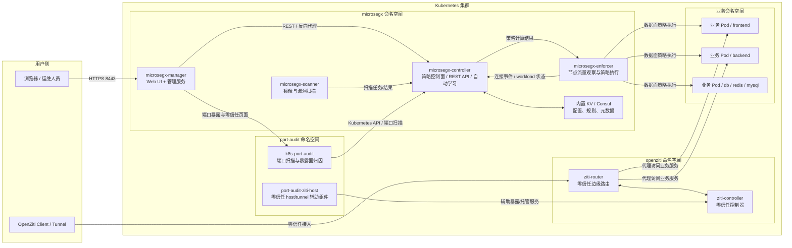
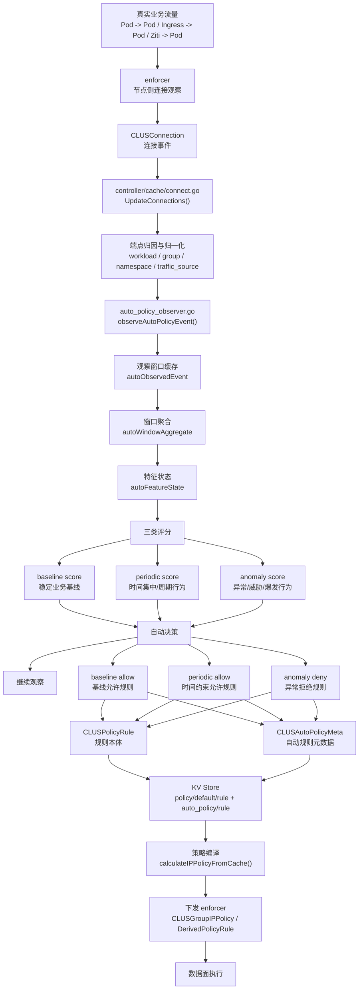
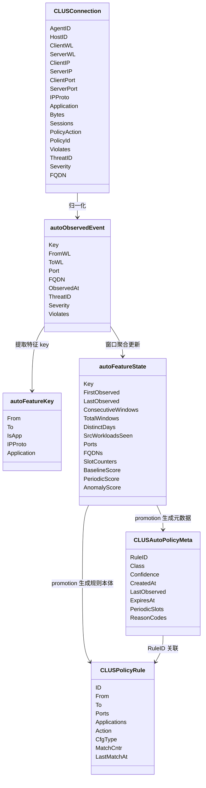
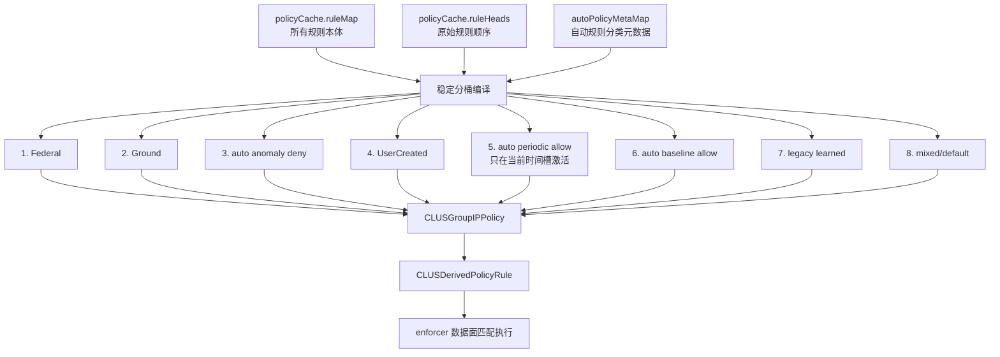
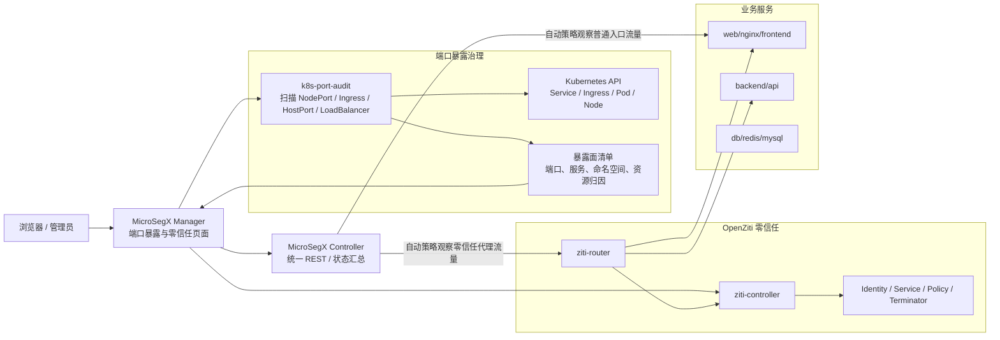
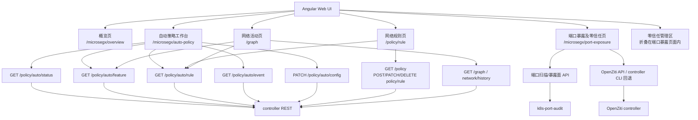
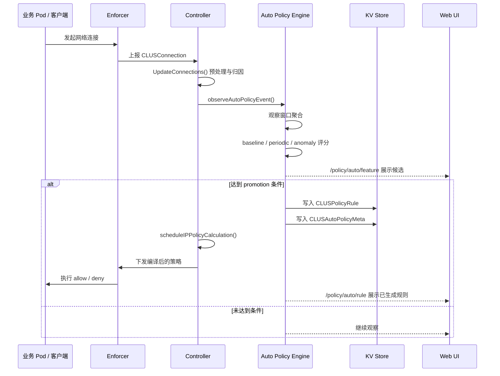

# MicroSegX 项目结构与系统架构图

本文档用于快速说明当前 `MicroSegX` 项目的整体代码结构、运行时组件关系、自动网络策略学习链路、端口暴露与零信任接入链路，以及策略编译下发链路。

本文档偏向“给论文、答辩、交接和后续开发使用”的结构说明，不展开具体代码实现。

---

## 1. 项目仓库结构图

```mermaid
flowchart TB
    Repo["MicroSegX 仓库根目录"]

    Repo --> Core["microsegx<br/>核心安全平台"]
    Repo --> Manager["manager<br/>Web 管理端与管理服务"]
    Repo --> Scanner["scanner<br/>漏洞/镜像扫描组件"]
    Repo --> Helm["microsegx-helm<br/>Kubernetes 部署模板"]
    Repo --> PortAudit["k8s-node-surface<br/>端口暴露治理与审计"]
    Repo --> Ziti["openziti<br/>零信任部署与集成资产"]
    Repo --> Ops["ops<br/>本地构建、交付和部署脚本"]
    Repo --> Docs["docs<br/>设计、执行、部署和说明文档"]
    Repo --> Artifacts["artifacts / docker-images / stage / target<br/>构建产物与本地交付物"]

    Core --> Controller["controller<br/>策略、缓存、REST、自动学习引擎"]
    Core --> Agent["agent<br/>节点侧 agent / enforcer 逻辑"]
    Core --> DP["dp<br/>数据面策略执行"]
    Core --> Share["share<br/>公共类型、协议、KV key、gRPC proto"]
    Core --> Upgrader["upgrader<br/>升级与证书任务"]

    Manager --> WebUI["admin/webapp<br/>Angular 前端"]
    Manager --> AdminSvc["admin<br/>Scala 管理服务"]
    Manager --> ManagerPkg["package<br/>manager 镜像打包"]

    PortAudit --> PortBackend["k8s_port_audit<br/>端口扫描与 Kubernetes 资源归因"]
    PortAudit --> PortWeb["web<br/>端口暴露治理前端/辅助界面"]
    PortAudit --> PortZiti["ziti<br/>端口治理与零信任联动脚本"]
```

---

## 2. 运行时总体架构图

说明：

- `manager` 面向浏览器，负责页面、管理入口和部分管理代理逻辑。
- `controller` 是核心控制面，负责资源缓存、策略生成、策略编译、REST API 和自动策略引擎。
- `enforcer` 是节点侧关键组件，负责观察真实网络连接并执行下发的策略。
- `scanner` 负责镜像/漏洞扫描能力。
- `k8s-port-audit` 负责端口暴露面扫描、归因和治理。
- `openziti` 负责零信任接入能力。

---

## 3. 自动网络策略学习链路

自动策略学习的核心原则：

- 不是每条连接立即生成规则。
- 连接先进入观察窗口。
- 窗口内相同通信行为被聚合成特征。
- 特征再根据稳定性、周期性和异常性进行评分。
- 只有达到条件后才 promotion 为正式规则。

---

## 4. 自动策略核心数据模型

说明：

- `CLUSPolicyRule` 是真正参与原有策略编译和下发的规则本体。
- `CLUSAutoPolicyMeta` 是新增元数据，用来表达自动策略分类、置信度、周期槽和 TTL。
- 自动规则复用 learned 规则段，但不进入旧版 learned 内存态。

---

## 5. 策略编译与运行时优先级

运行时顺序的含义：

- 平台治理规则优先。
- 自动异常拒绝规则高于用户以下的自动允许规则。
- 用户手动规则保留明确优先级。
- 周期允许规则只在当前时间槽命中时注入。
- 旧版 learned 规则排在自动允许之后，便于逐步过渡。

---

## 6. 端口暴露治理与零信任链路

说明：

- 端口暴露治理用于发现“哪些服务直接暴露在集群外部或节点端口上”。
- OpenZiti 用于提供零信任入口。
- 自动策略系统会把普通入口链路和零信任链路分开归因、分开学习、分开展示。

---

## 7. 前端页面与后端接口关系

---

## 8. 典型数据流：从业务访问到规则生效

---

## 9. 论文/答辩推荐使用方式

建议在论文或答辩 PPT 中使用以下图：

- 总体架构：使用第 2 节“运行时总体架构图”。
- 核心创新：使用第 3 节“自动网络策略学习链路”。
- 数据模型：使用第 4 节“自动策略核心数据模型”。
- 工程闭环：使用第 5 节“策略编译与运行时优先级”。
- 外部板块：使用第 6 节“端口暴露治理与零信任链路”。

如果只能放一张总图，建议使用第 2 节；如果讲自动策略核心贡献，建议使用第 3 节。
